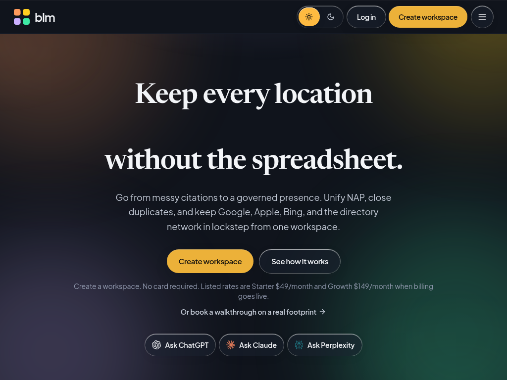
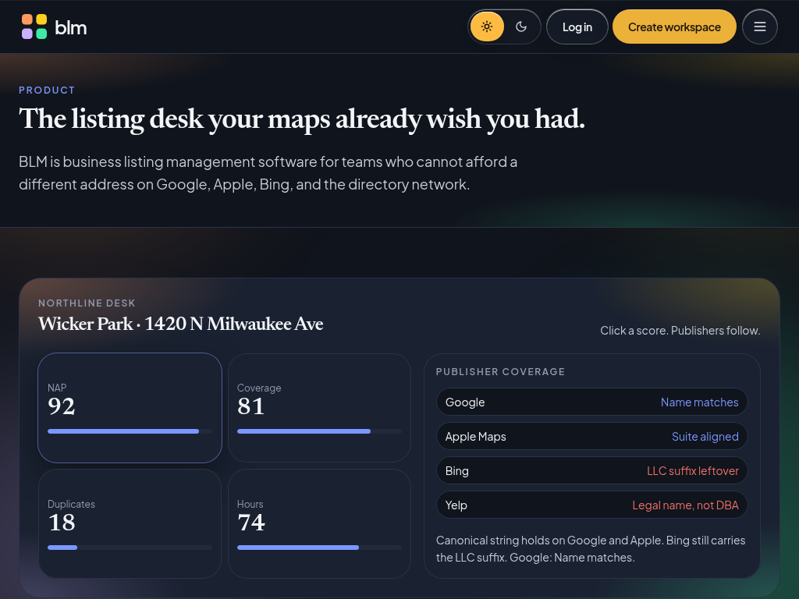
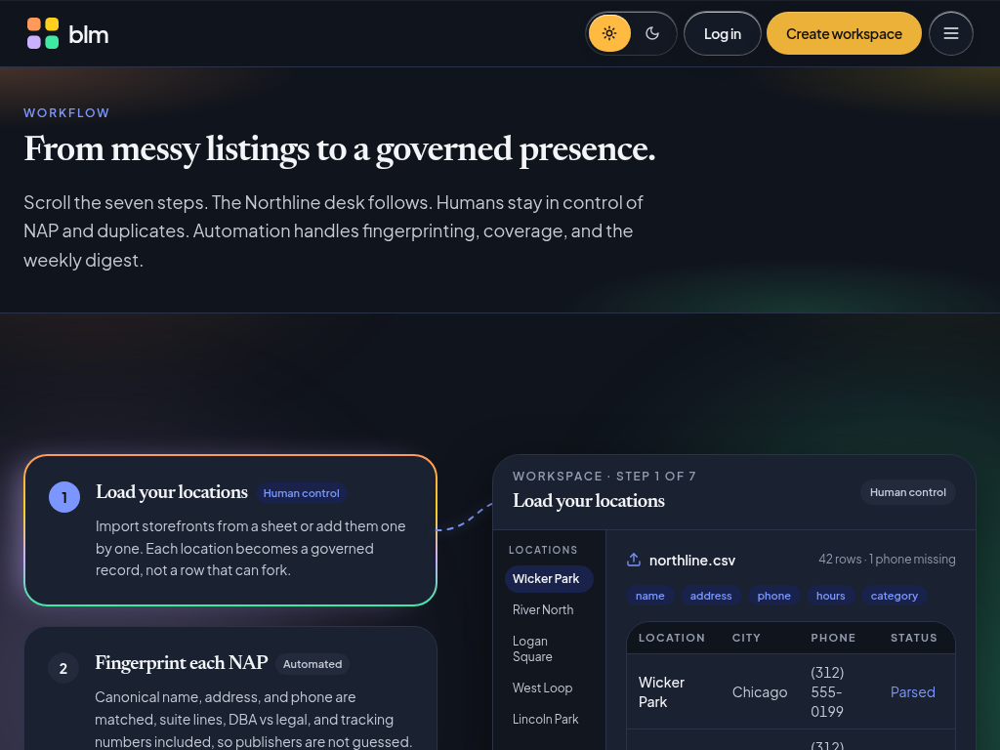
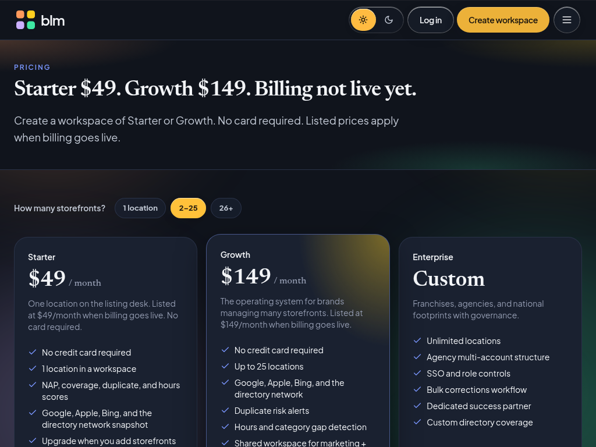
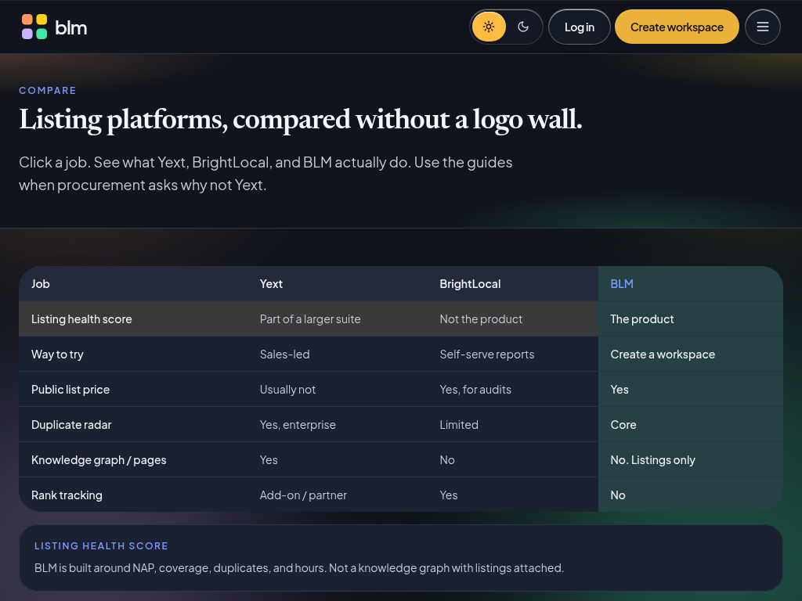
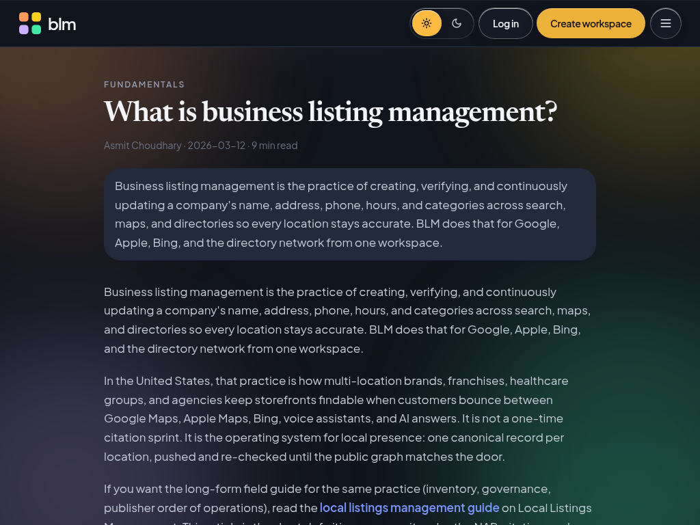

# Business Listing Management (BLM)

  

**Keep every location accurate across Google, Apple, Bing, and the directory network, from one workspace.**

**Live site:** [https://businesslistingmanagement.com](https://businesslistingmanagement.com)

---

## Screenshots

| Home | Product |
|:---:|:---:|
|  |  |

| How it works | Pricing |
|:---:|:---:|
|  |  |

| Compare | Blog |
|:---:|:---:|
|  |  |

  

---

## What is BLM?

**Business Listing Management (BLM)** helps multi-location brands, franchises, agencies, and local SEO teams keep listings accurate across maps and directories.

Inconsistent **NAP** (name, address, phone), duplicate profiles, and stale hours quietly hurt discovery and reviews. BLM is built around one idea: a canonical listing per location, then clear visibility into where publishers match, drift, or duplicate that source of truth.

---

## What I built

A full product surface for listing accuracy, not a landing page alone:

- **Marketing site** with product story, how it works, pricing, resources, glossary, security, and demo booking
- **Compare hub** with independent guides for teams evaluating listing software
- **Blog and CMS desk** for publishing, inbox, and audience workflows
- **Workspaces** for brands and agencies to manage multi-location listings
- **Contact and newsletter** flows that fit the product narrative
- **Product UI** focused on clarity: health, coverage, and actionable listing state

---

## Why it matters

- **Canonical NAP** - One approved name, address, and phone per location. Publishers are compared against that string, including suite, tracking number, and DBA vs legal name.
- **Duplicate detection** - Near-matches on phone, place, and name surface as risk, with a suggested surviving listing so reviews and photos are not orphaned.
- **Hours that stay current** - Holiday hours and temporary closures are treated as listing health, not a footnote. Stale Apple or Bing hours matter as much as a wrong phone.
- **Coverage you can defend** - See which publishers have the location, which are stale, and which never received it. Scores marketing and ops can share in a QBR or weekly digest.
- **Compare guides for buyers** - Practical content for teams weighing alternatives and deciding what "good listing management" should look like.

---

## Feature highlights

- Listings sync and health across maps and directories
- Hours and category hygiene alongside NAP consistency
- Duplicate radar with a suggested survivor
- QBR-ready coverage and risk views
- Compare hub for Yext, BrightLocal, and similar evaluations
- Workspaces for brands, franchises, and agencies
- Marketing and product experience in one cohesive app

---

## Stack

Built with **React**, **TypeScript**, and **Vite**, with a modern component and routing stack for a fast marketing and product experience.

---

## License

All rights reserved. This repository is a portfolio piece and is not open source.

---

### Made by Asmit

Built by **Asmit** · [casmit510@gmail.com](mailto:casmit510@gmail.com)
